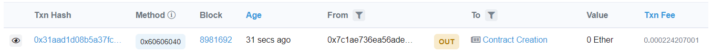

# Solidity
Smart contract course in 2021 Summer

This repo constructs an environment to test and deploy a smart contract to [metamask](https://metamask.io/)

## Environment Setting

First create a folder to do the project.

```bash
mkdir Inbox
cd Inbox
npm init
```

Install the solidity compiler by npm.

```bash
npm install --save solc@0.4.7
```

`compile.js`  then use this compiler to compile a solidity program.

Uncomment `console.log()` (in `compile.js` line 9) to see the compiling details, including the API and the bytecode.

Next install [mocha](https://mochajs.org/), [ganache-cli](https://www.trufflesuite.com/ganache), and [web3](https://web3js.readthedocs.io/en/v1.3.4/). These are all used to test the smart contract.

```bash
npm install --save mocha ganache-cli web3@1.3.5
```

Finally modify the column `test ` in `package.json` as the following

```js
"scripts": {
  "test": "mocha"
```

By above we can use mocha to do our test work.

We can now modify the file in `test/` to design the test framework.

## Compile

Enter

```bash
node compile.js
```

## Test

Enter

```bash
npm run test
```

## Deploy

We need a HD wallet management pakcage to help us do the deployment, so first install the pakcage.

```bash
npm install truffle-hdwallet-provider@0.0.3
```

We use [infura](https://infura.io/) to help us deploy our smart contract to the formal blockchain internet(e.g. Rinkeby). First register an account in infura, and create a new project. Choose desired endpoints in the setting; for instance, Rinkeby.

Next modify `deploy.js`, add your account mnemonic words for metamask and the url in the infura setting.

```js
const provider = new HDWalletProvider(
  // remember to change this to your own phrase!
  "xxx xxx xxx xxx xxx xxx xxx xxx xxx xxx xxx xxx",
  
  // remember to change this to your own endpoint!
  "https://rinkeby.infura.io/v3/xxxxxxxxxx"
);
```

Finally run the `deploy.js`

```bash
node deploy.js
```

We can go to [Etherscan] (https://etherscan.io/) to check our deployment. If all go well, there should be a record of the contract creation.



